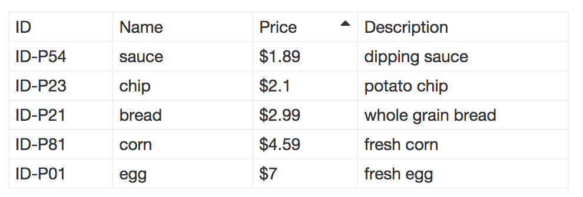

table
=====

Reactlet table component



```
<link rel="stylesheet" href="/component/common/common-style.css"/>
<link rel="stylesheet" href="/component/table/table.css"/>

<script src="/library/react/react.js"></script>
<script src="/library/react/JSXTransformer.js"></script>
<script type="text/jsx" src="/component/common/common-mixin.js"></script>
<script type="text/jsx" src="/component/table/table.js"></script>


app.getIdText = function(id) {
    return 'ID-' + id;
}
app.table3Data = {
    boxClass: 'table-container-bordered',
    colModel: {
        id: { name:'id', text:'ID', width:'15%', key:true, format:app.getIdText },
        name: { name:'name', text:'Name', width:'20%', sort:'up' },
        price: { name:'price', text:'Price', width:'15%', type:'money' },
        description: { name:'description', text:'Description', width:'30%' },
        extra: { name:'extra', text:'Extra', show:false, width:'10%' }
    },
    dataItems:[
        { id:'P01', name:'egg', price:7, description:'fresh egg', extra:'n/a' },
        { id:'P21', name:'bread', price:2.99, description:'whole grain bread', extra:'n/a' },
        { id:'P23', name:'chip', price:2.1, description:'potato chip', extra:'n/a' },
        { id:'P54', name:'sauce', price:1.89, description:'dipping sauce', extra:'n/a' },
        { id:'P81', name:'corn', price:4.59, description:'fresh corn', extra:'n/a' }
    ]
};
app.table3 = React.renderComponent(
    <Table data={ app.table3Data } />,
    document.getElementById('table3')
);

```
